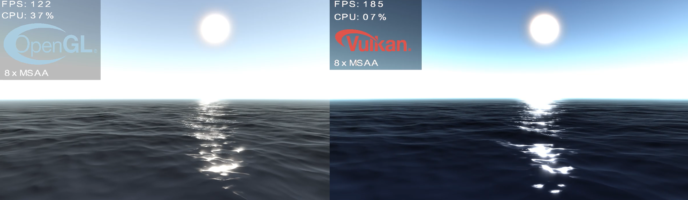
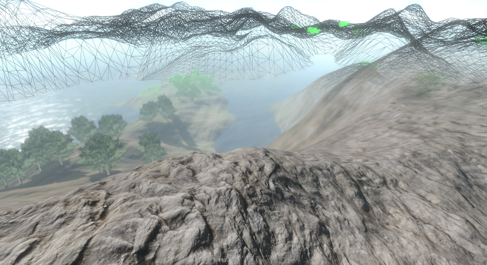
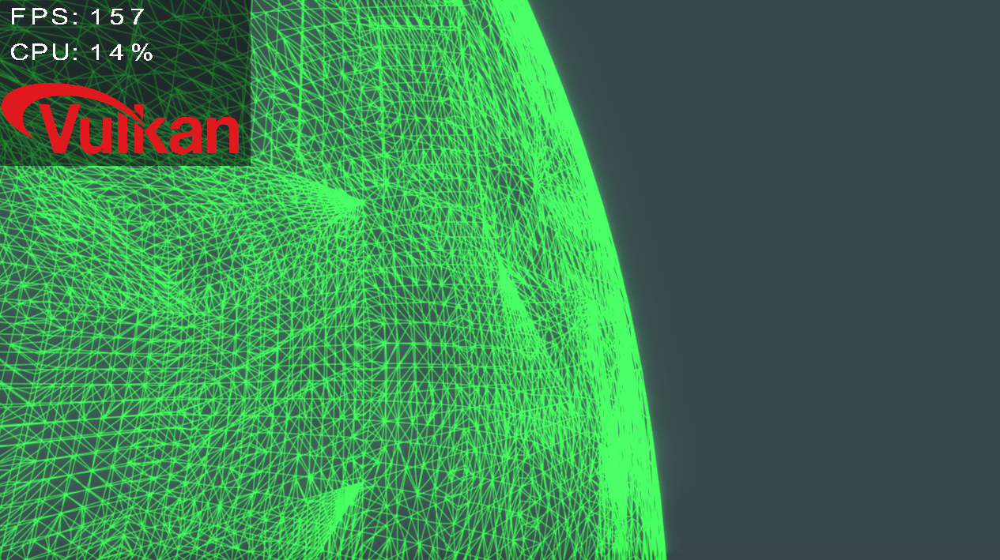
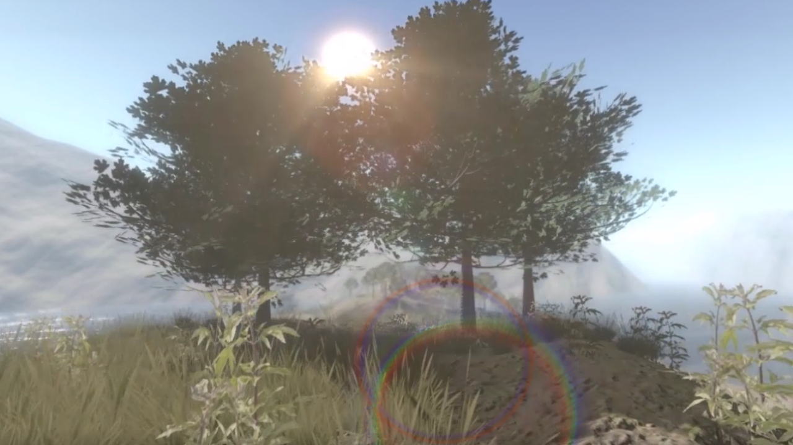
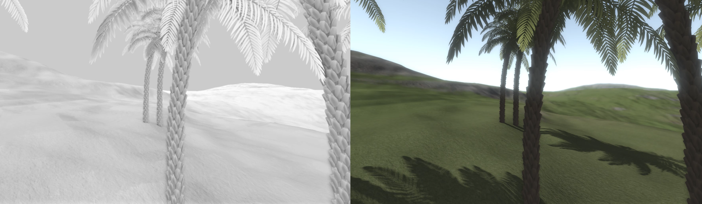

# Oreon Engine (Java - OpenGL/Vulkan)
Welcome to the Cross-Platform Java 3D Engine.
As OpenGL and Vulkan Binding for Java the [LWJGL 3](https://www.lwjgl.org/) API is used.  
Both OpenGL and the next generation graphics API Vulkan is supported!

## Build Manual
* Oreon Engine project uses [lombok](https://projectlombok.org/).
  Please download the latest [release](https://projectlombok.org/download) of lombok and run the .jar to install lombok plugin into Eclipse.

* Getting started guide for Eclipse available [here](http://oreonengine.github.io/oreon-engine/_navigation/Getting_Started.html).

## Example Open World Ocean OpenGL Demo
* [examples-opengl](https://github.com/oreonengine/oreon-engine/tree/master/oreonengine/examples-opengl)
  [GLOreonWorlds](https://github.com/oreonengine/oreon-engine/blob/master/oreonengine/examples-opengl/src/main/java/org/oreon/examples/gl/oreonworlds/GLOreonworlds.java)

## Example Vulkan Ocean Demo
* [examples-vulkan](https://github.com/oreonengine/oreon-engine/tree/master/oreonengine/examples-vulkan)
  [VkOrenworlds](https://github.com/oreonengine/oreon-engine/blob/master/oreonengine/examples-vulkan/src/main/java/org/oreon/examples/vk/oreonworlds/VkOreonworlds.java)

## Camera Control
* Move: W, A, S, D
* Rotate: Hold the middle mouse button while moving the mouse
* Accelerate Movespeed: Scroll mouse

## Features
### Deferred rendering pipeline with up to 8x MSAA and FXAA
### LOD Quadtree 
#### Terrain

#### WIP Planet

### FFT Water

### Skydome/Atmosphere and Dynamic Sunlight

### Shadow Mapping
#### Parallel Split Shadow Mapping + Variance Shadows

### Tessellation with Normal-/Displacement-Mapping

### Post-Processing Effects
#### Motion Blur, Depth of Field Blur, Bloom

#### Light Scattering, Lens Flare

#### SSAO
  

### GUI
## Credits
* [Nvidia Corporation](https://developer.nvidia.com/)
* [World Creator](https://www.world-creator.com/)