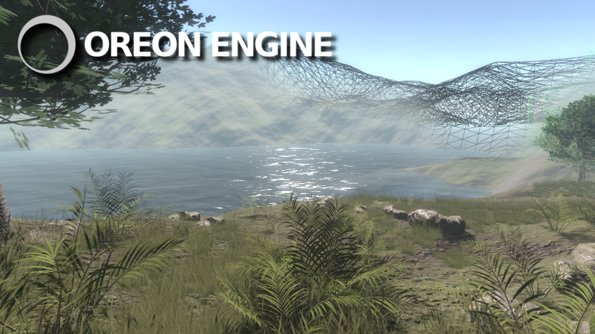
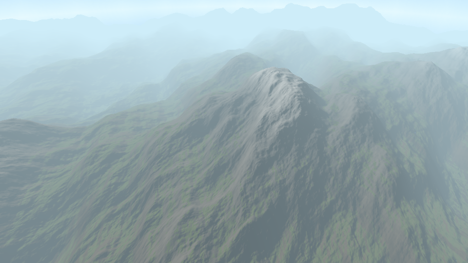
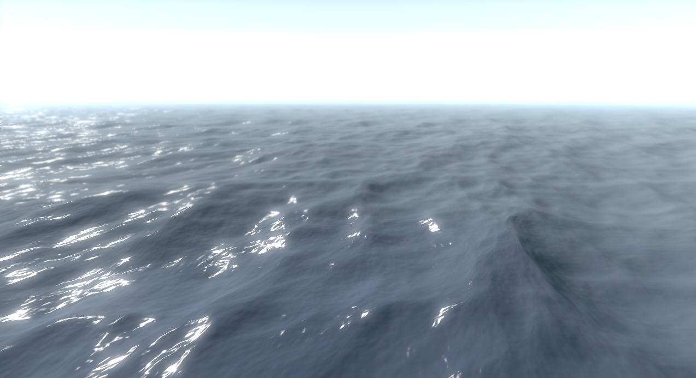
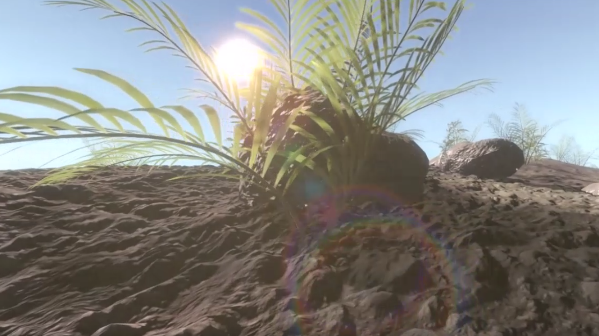
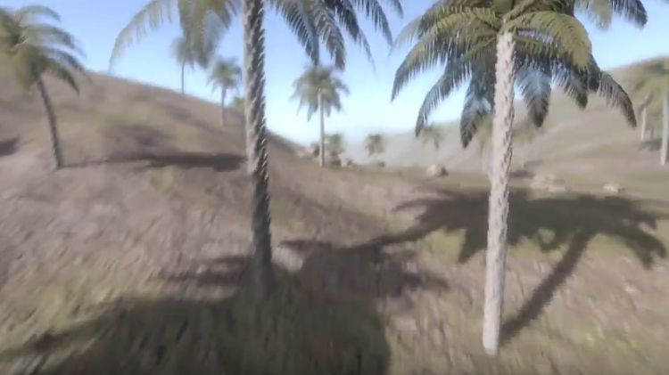
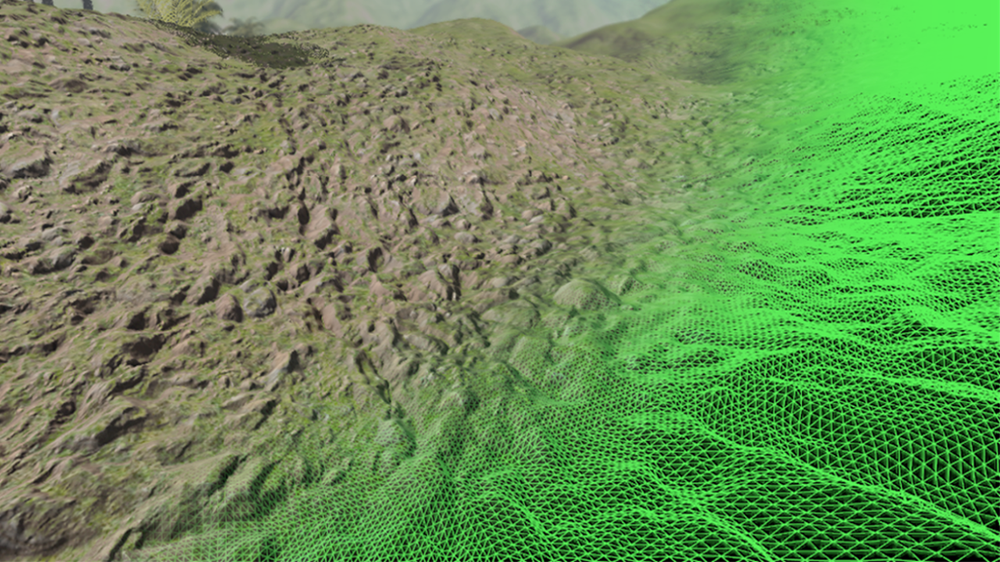
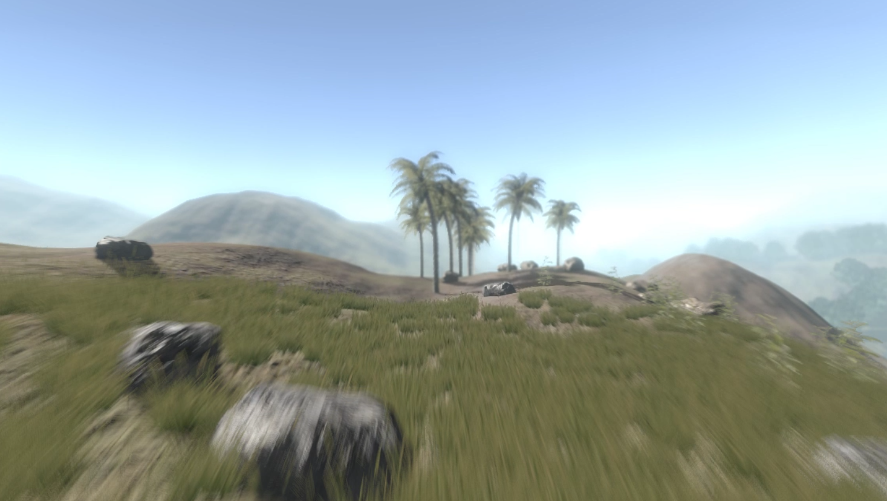
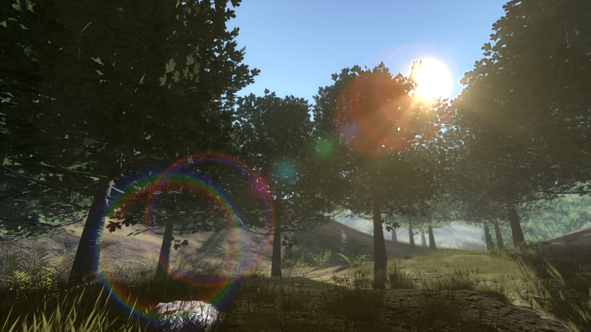

# Oreon Engine OpenGL/Java
Welcome to the Cross-Platform 3D OpenGL Engine.
As OpenGL Binding for Java the [LWJGL 3](https://www.lwjgl.org/) API is used.

Documentation: http://oreonengine.github.io/oreon-engine

## Build Manual
Eclipse-Tutorial: http://oreonengine.github.io/oreon-engine/_navigation/Getting_Started.html

## Running Oreonworlds Open World Simulation
* Run apps.oreonworlds.Main as Java Application

## Camera Control
* Move: W, A, S, D
* Rotate: Hold the middle mouse button while moving the mouse
* Accelerate Movespeed: Scroll mouse

## Features
### Quadtree Terrain
Generated by precomputed FFT Fractal Maps 

 

### FFT Water
height displacement and Choppy displacement

### Skydome/Atmosphere
### Dynamic Sunlight

### Parallel Split Shadow Mapping

### Variance Shadows
### Percentage Closer Shadow Mapping
### 2x - 8x Multisample Anti-Aliasing
### Tessellation
### Normal- /Displacement-Mapping

### Instanced Rendering
### Post-Processing Effects

#### Motion Blur
#### Depth of Field Blur
#### Bloom
#### Light Scattering
#### Lens Flare

### GUI
## Credits